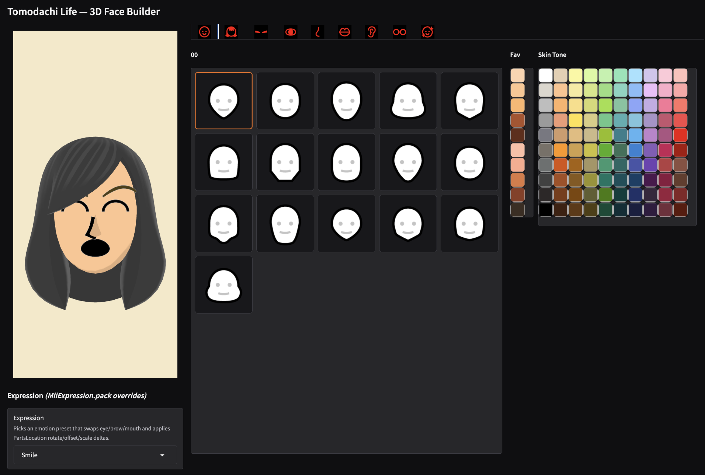
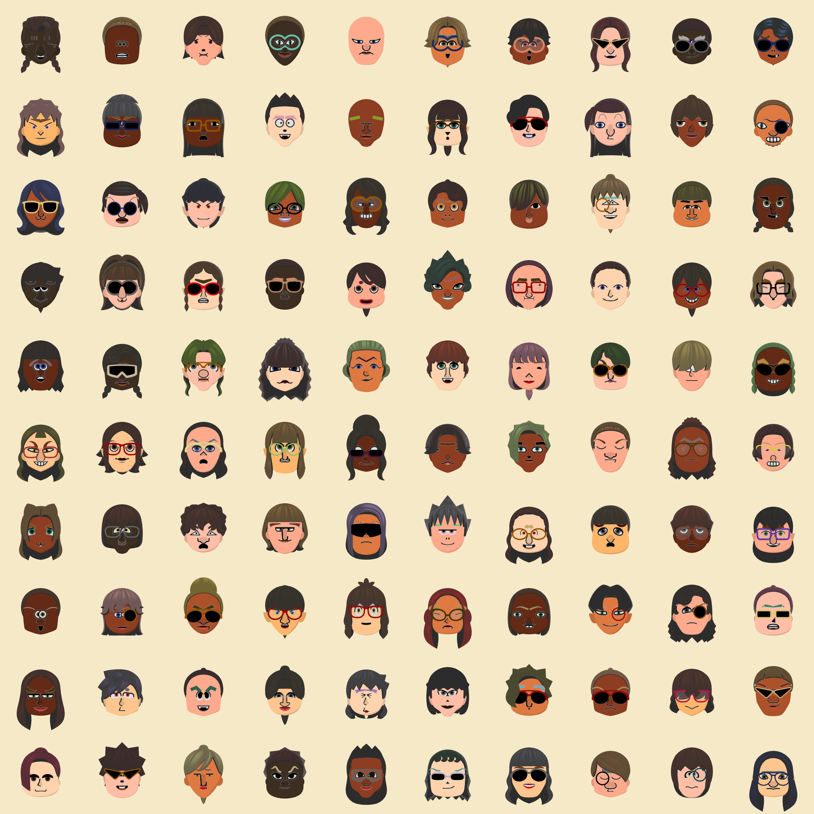
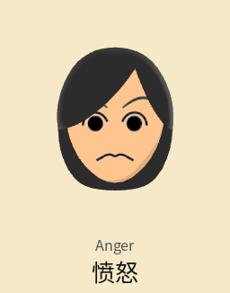

# Tomodachi Life: Living the Dream — 3D Face Builder

Gradio demo that composes a Mii face texture from extracted Tomodachi Life:
Living the Dream game assets and applies it to an extracted GLB head mesh, shown
in an interactive 3D viewer.



A grid of randomized faces, and the expression presets in motion:





## Setup

Dependencies are managed with [uv](https://docs.astral.sh/uv/):

```
uv sync
```

The 3D viewer loads `@google/model-viewer` from a CDN at runtime, so the demo
needs an internet connection but no Node/npm install.

## Run the demo

```
uv run python face_3d_demo.py
```

This launches the Gradio UI and opens it in your browser at
`http://127.0.0.1:7860`. Pick eyes/brows/mouth/hair/etc. from the galleries and
the composed face is rendered onto the head mesh live.

### Remote-access options

Set these environment variables at launch:

| Variable                  | Effect                                        |
|---------------------------|-----------------------------------------------|
| `MII_SHARE=1`             | Publish via Gradio's `gradio.live` tunnel     |
| `MII_HOST=0.0.0.0`        | Listen on all interfaces (LAN access)         |
| `MII_PORT=7860`           | Custom port (default `7860`)                  |
| `MII_AUTH=user:password`  | Require HTTP basic auth                        |

## Repo layout

- `face_3d_demo.py` — Gradio UI + face-texture compositor + 3D scene assembler.
- `mii_metadata.py` — loaders for the converted BGYML/RSDB metadata (parts,
  parts-order, expressions, parts-locations, eye-accessory table).
- `assets/` — all data the demo loads (bundled; paths resolve relative to the
  source files, so the repo is self-contained):
  - `assets/glb/`          — head/hair/etc. GLB meshes (`MiiBeard00.glb`, …)
  - `assets/miiparts_png/` — per-part PNGs (`<Category><index>.png`, e.g. `Eye060.png`)
  - `assets/mii_metadata/` — converted Mii BGYML tree (parts, parts-order,
                             expressions, parts-locations, eye-accessory table)

## Known limitations

- 2D-asset placement for makeup and mustache is still wrong and needs fixing.
- Colors are not yet fully matched to the game.
- Component sizes need to be scaled to match the game.
- Reverse rendering is still WIP.
